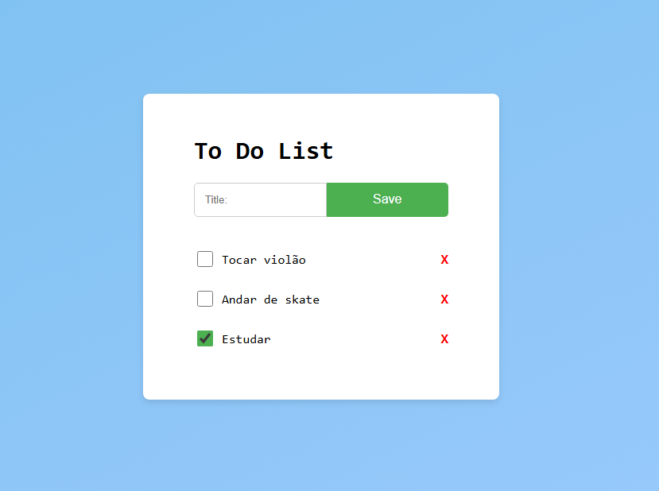

# To-Do List



## Descrição

Uma lista de tarefas com possibilidade de adição, remoção e conclusão de atividades.

Desenvolvi esse projeto (pequeno e genérico) apenas com o objetivo de praticar
o que estudei sobre: Docker, GitHub Actions, GitFlow, Servlets, Tomcat, JSP/JSTL,
JDBC e Log4j2 com Slf4j.

<br>

## Tecnologias Utilizadas

- **Java 21**
- **Docker**
- **GitHub Actions**
- **Servlets**
- **JSP/JSTL**
- **Tomcat**
- **JDBC + MySQL**
- **HikariCP**
- **Slf4j + Log4j2**

<br>

## Estrutura de Arquivos

A organização do projeto segue uma estrutura simples, que pode ser melhorada posteriormente:
```
To-do-list/
    ├── .github
    │   ├── workflows/                          # Arquivos .yml para CI/CD com GitHub Actions
    │       ├── pipeline.yml                  
    ├── tasks/
    │   ├── src/main/
    │   │   ├── java/com/leoduarte/
    │   │   │   ├── config/                     # Classes de configuração (ex: pool de conexões para o banco)
    │   │   │   ├── dao/                        # Classes de consulta e acesso banco
    │   │   │   ├── dto/                        # Classes de abstração e transferência de dados
    │   │   │   ├── factory/                    # Padrão de projeto criacional para instânciação e configuração de objetos
    │   │   │   ├── mapper/                     # Conversor de objetos (dto para model, e model para dto)
    │   │   │   ├── model/                      # Classes modelos (dados e entidades ligadas ao banco)
    │   │   │   ├── service/                    # Lógica de negócio
    │   │   │   ├── servlet/                    # Servlets responsáveis por atender/servir os end-points http
    │   │   ├── resources/                      # Configurações do projeto 
    │   │   │   ├── log4j2.xml                  # Configuração do log4j2 
    │   │   ├── webapp/                         # Front-end
    │   │       ├── assets/                     # Arquivos estáticos (css, js, imagens)
    │   │       │   ├── css/
    │   │       │   │   ├── style.css
    │   │       │   ├── js/   
    │   │       │   │   ├── script.js
    │   │       ├── WEB-INF/                    # Arquivos ocultos do navegador (web.xml, classes java compiladas, JAR, etc)
    │   │           ├── includes/               # Conteúdo incluso nas views
    │   │           │   ├── footer.jsp
    │   │           │   ├── formNewTask.jsp
    │   │           │   ├── header.jsp
    │   │           ├── views/                  # Páginas
    │   │           │   ├── tasks.jsp
    │   │           ├── index.jsp
    │   ├── .gitignore                          # Arquivos a serem ignorados no controle de versão
    │   ├── Dockerfile                          # Imagem Docker com build e preparação do ambiente
    │   ├── pom.xml                             # Arquivo de configuração do Maven
    ├── .env                                    # Variáveis de ambiente usadas pelo docker-compose e pelo Java
    ├── .gitignore                              # Arquivos a serem ignorados no controle de versão
    ├── docker-compose.yml                      
    ├── README.md                               # Documentação do projeto
    ├── schema.sql                              # Modelo lógico do banco de dados
```

<br>

## Como Usar

***Nota Importante:*** É necessário ter o **docker instalado**. 

1. **Clone o repositório:**
    ```bash
    git clone https://github.com/LeoDuarte37/To-do-list.git
    ```

2. **O arquivo .env é oculto do projeto, logo você deve cria-lo e configurar seguindo o modelo abaixo:**
    ```
    DB_HOST=mysql                          
    DB_PORT=3306                           
    DB_NAME=db_tasks                       
    DB_ROOT_PASS=root                      
    DB_USER=user                            
    DB_PASS=password                           
    DB_URL=jdbc:mysql://mysql:3306/db_tasks
                                                                                    
    DB_POOL_SIZE=10                        
    DB_MINIMUM_IDLE=2                      
    DB_IDLE_TIMEOUT=300000                 
    DB_CONNECTION_TIMEOUT=30000
    ```
    
    ***Você pode alterá-lo, desde que reconfigure na classe ConnectionPool e no docker-compose.***

<br>

3. **Na pasta raiz To-do-list:**
    ```bash
    docker compose up --build
    ```

4. **Acesse no navegador:**
    ```
    localhost:8080/todolist/ 
    ```

<br>

## Como Contribuir 💡 

### Git Flow

- `main`: código de produção, sempre estável.
- `developer`: onde novas funcionalidades e correções são integradas.
- `feature/*`: desenvolvimento de novas funcionalidades.
- `release/*`: preparação para uma nova versão estável.
- `hotfix/*`: correções urgentes na produção.

### Padrão de Commits

Siga o padrão abaixo ao fazer commits:

```bash
<tipo>(escopo opcional): descrição
```

**Tipos comuns**
- feat: nova funcionalidade
- fix: correção de bug
- docs: mudanças na documentação
- style: formatação (espaços, ponto e vírgula, etc — sem alterar lógica)
- refactor: refatoração sem alterar comportamento
- perf: melhoria de performance
- test: adição ou alteração de testes
- chore: tarefas sem impacto no código de produção (ex: configs, builds)
- build: alterações relacionadas à build (Docker, Maven, Gradle, etc)
- ci: alterações em arquivos de CI/CD (GitHub Actions, Jenkins, etc)

### Siga estas etapas

1. **Faça um fork deste repositório e clone para sua máquina.**

2. **Crie uma branch para sua feature a partir da developer:**
    ```bash
    git checkout developer
    git checkout -b feature/nome-da-sua-feature
    ```

3. **Após o desenvolvimento, faça commit e push para o seu fork:**
    ```bash
    git commit -m "feat: implementar nova funcionalidade"
    git push origin feature/nome-da-sua-feature
    ```

4. **Abra um Pull Request da sua branch feature/* para a branch developer deste repositório.**

<br>

## Autor
- **Leonardo Duarte**

